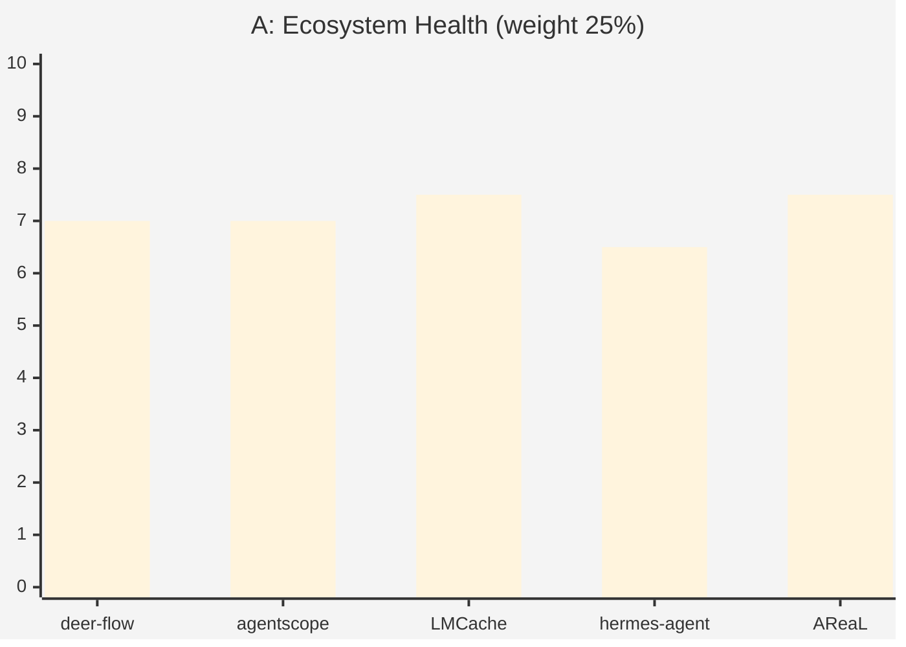
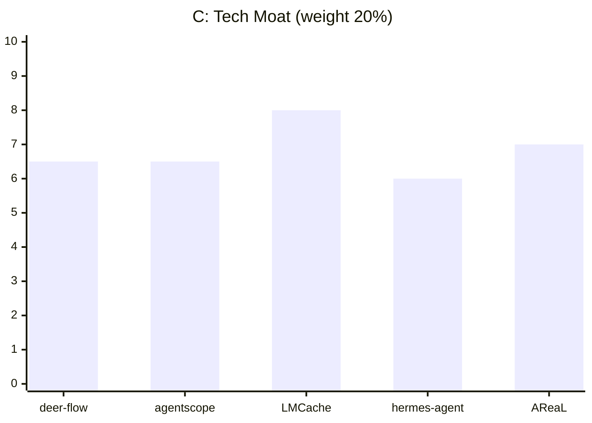
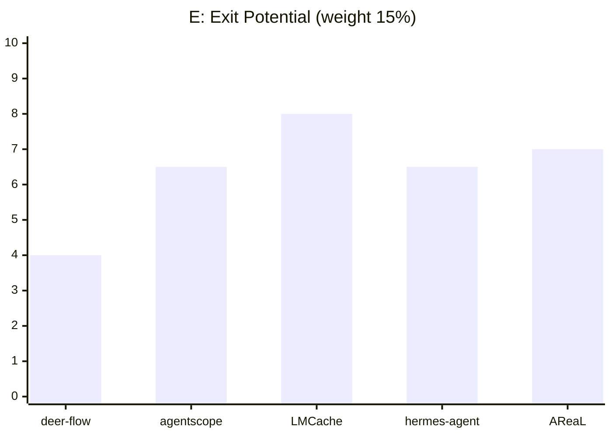

# 🔭 AgentVC Index — OSS Investment Case Database

> Curated by **Lucy Chen** · [linkedin.com/in/lucycxy](https://linkedin.com/in/lucycxy)  
> Framework: [OSS Investment Scorecard v1.1](https://github.com/el09xccxy-stack/oss-investment-scorecard)  
> GitHub Org: [github.com/el09xccxy-stack/agentvc-index](https://github.com/el09xccxy-stack/agentvc-index)

---

## 📐 Scoring Framework

| Dimension | Weight | Description |
|---|---|---|
| **A · Ecosystem Health** | 25% | Stars velocity, contributor diversity, governance |
| **B · Team** | 20% | Independence, domain depth, full-time commitment |
| **C · Tech Moat** | 20% | Defensibility, systems complexity, IP |
| **D · PMF** | 20% | Customer pull, revenue signal, market timing |
| **E · Exit** | 15% | Acquirer landscape, comp set, structure |

**Thresholds:** 🟢 8.5+ Invest · 🟡 7.0–8.4 Yellow · 🟠 5.5–6.9 Watch · 🔴 <5.5 Pass  
**Benchmarks:** vLLM / Inferact = 8.9 · HuggingFace = 8.35

---

## 📊 Case Index

### Week of 2026-03-23 (W13)

| Project | Score | Verdict | Case File |
|---|---|---|---|
| Unsloth | **8.10** | 🟡 Yellow (Strong) | [→](cases/2026-03-23_unsloth.md) |
| Hindsight | **7.55** | 🟡 Yellow | [→](cases/2026-03-23_hindsight.md) |
| DeepAgents | **7.45** | 🟡 Yellow | [→](cases/2026-03-23_deepagents.md) |
| TradingAgents | **6.35** | 🟠 Watch | [→](cases/2026-03-23_tradingagents.md) |
| MiroFish | **5.54** | 🟠 Watch | [→](cases/2026-03-23_mirofish.md) |

### Week of 2026-03-08 (W10)

| Project | Score | Verdict | Case File |
|---|---|---|---|
| LMCache | **7.78** | 🟡 Yellow | [→](cases/2026-03-08_lmcache.md) |
| AReaL | **7.23** | 🟡 Yellow | [→](cases/2026-03-08_areal.md) |
| AgentScope | **6.73** | 🟠 Watch | [→](cases/2026-03-08_agentscope.md) |
| Hermes Agent | **6.30** | 🟠 Watch | [→](cases/2026-03-08_hermes-agent.md) |
| DeerFlow | **6.15** | 🟠 Watch ⚠️ Corp | [→](cases/2026-03-08_deer-flow.md) |
---

## 📋 Evaluated Projects (Community Submissions)

| Project | Score | Verdict | Submitted by | Date |
|---|---|---|---|---|
| [vLLM / Inferact](https://github.com/vllm-project/vllm) | 8.9/10 | 🟢 Strongly Recommend | @lucycxy | 2026-03 |
| [HuggingFace](https://github.com/huggingface/transformers) | 8.35/10 | 🟢 Strongly Recommend | @lucycxy | 2026-03 |
| [LMCache/LMCache](cases/2026-03-08_lmcache.md) | 7.78/10 | 🟡 Yellow | @lucycxy | 2026-03 |
| [inclusionAI/AReaL](cases/2026-03-08_areal.md) | 7.23/10 | 🟡 Yellow | @lucycxy | 2026-03 |
| [agentscope-ai/agentscope](cases/2026-03-08_agentscope.md) | 6.73/10 | 🟠 Watch | @lucycxy | 2026-03 |
| [NousResearch/hermes-agent](cases/2026-03-08_hermes-agent.md) | 6.30/10 | 🟠 Watch | @lucycxy | 2026-03 |
| [bytedance/deer-flow](cases/2026-03-08_deer-flow.md) | 6.15/10 | 🟠 Watch ⚠️ Corp | @lucycxy | 2026-03 |
| *(your project here)* | | | | |

*This table is updated as community submissions are reviewed. [Submit yours →](https://github.com/el09xccxy-stack/agentvc-index/issues/new)*

---

### Dimension Breakdown Heatmap







---

### Full Dimension Table

| Project | A (25%) | B (20%) | C (20%) | D (20%) | E (15%) | **Total** |
|---|---|---|---|---|---|---|
| deer-flow | 7.0 | 6.5 | 6.5 | 6.0 | 4.0 | **6.15** |
| agentscope | 7.0 | 6.5 | 6.5 | 7.0 | 6.5 | **6.73** |
| LMCache | 7.5 | 7.5 | 8.0 | 8.0 | 8.0 | **7.78** |
| hermes-agent | 6.5 | 7.0 | 6.0 | 5.5 | 6.5 | **6.30** |
| AReaL | 7.5 | 7.0 | 7.0 | 7.5 | 7.0 | **7.23** |

---

## 🗂 Repo Structure

```
agentvc-index/
├── README.md          ← this file (auto-updated weekly)
└── cases/
    ├── 2026-03-08_deer-flow.md
    ├── 2026-03-08_agentscope.md
    ├── 2026-03-08_lmcache.md
    ├── 2026-03-08_hermes-agent.md
    └── 2026-03-08_areal.md
```

---

## 📅 Archive

| Week | Projects Scored | Yellow+ | New This Week |
|---|---|---|---|
| [2026-W10 (Mar 8)](cases/) | 5 | 2 (LMCache, AReaL) | deer-flow, agentscope, LMCache, hermes-agent, AReaL |

---

*AgentVC Index · OSS Investment Scorecard v1.1 · Curated by Lucy Chen · [linkedin.com/in/lucycxy](https://linkedin.com/in/lucycxy)*
