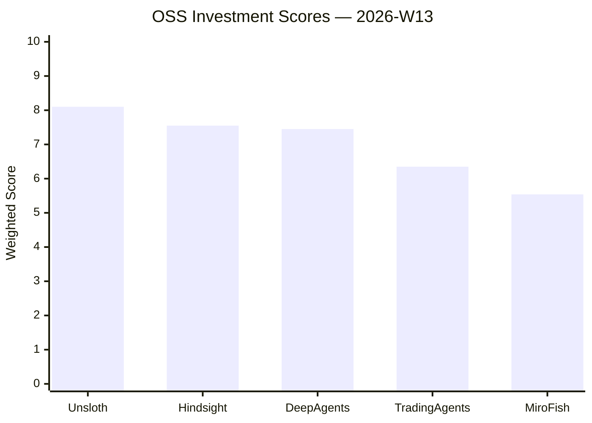
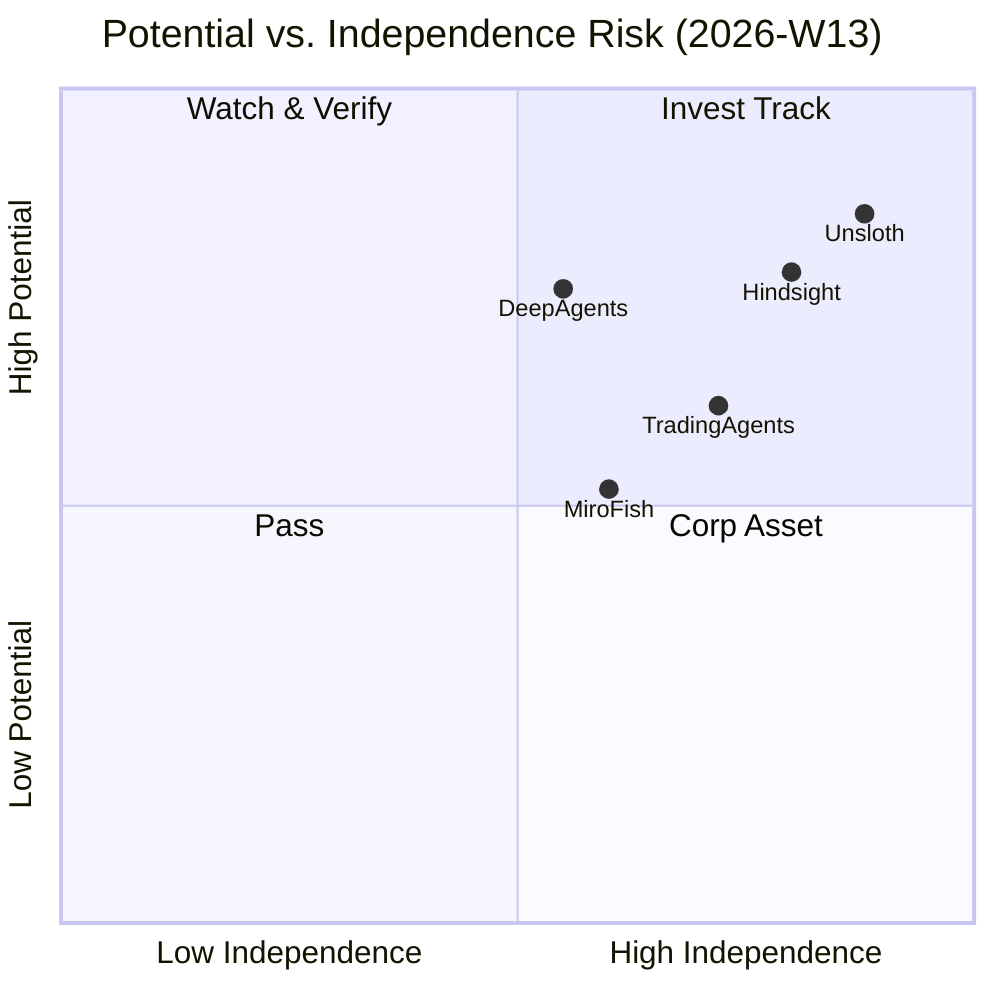
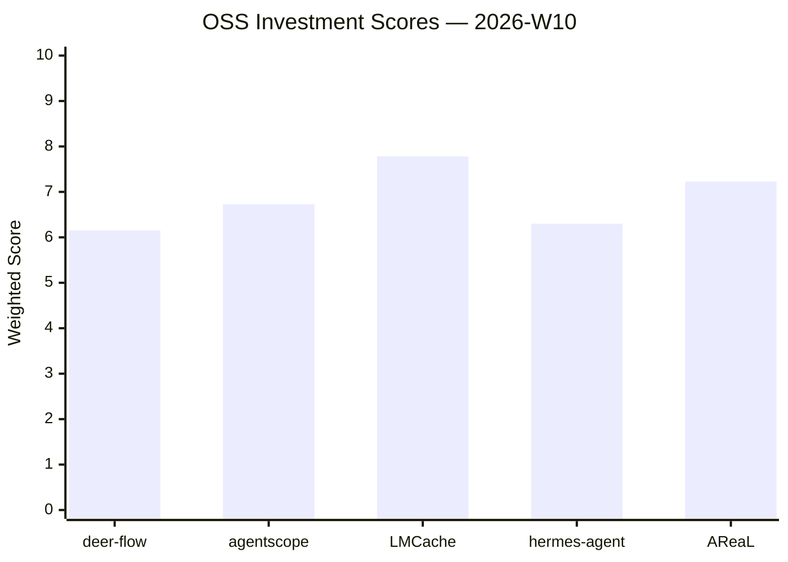
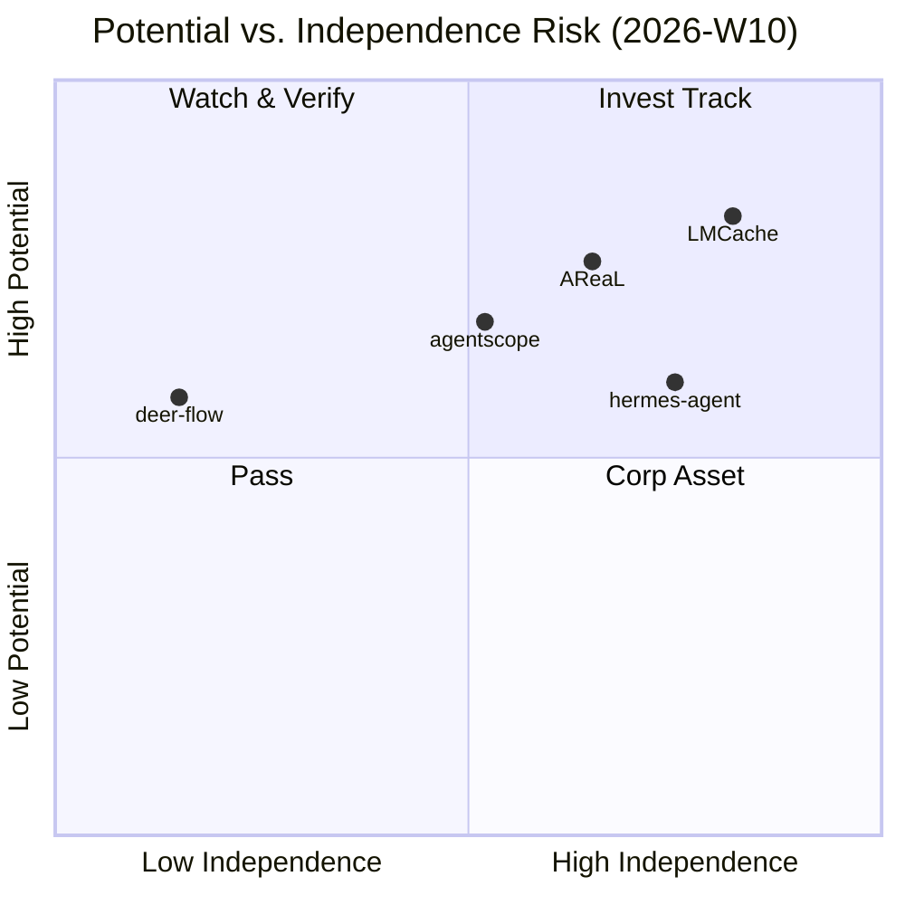
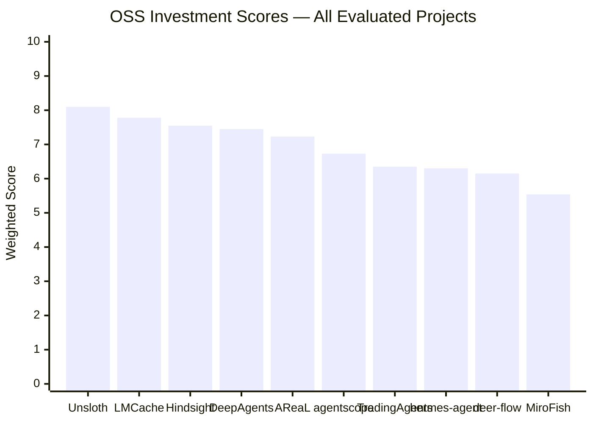

# 🔭 AgentVC Index — OSS Investment Case Database

> Curated by **Lucy Chen** · [linkedin.com/in/lucycxy](https://linkedin.com/in/lucycxy)  
> Framework: [OSS Investment Scorecard v1.1](https://github.com/el09xccxy-stack/oss-investment-scorecard)  
> GitHub Org: [github.com/el09xccxy-stack/agentvc-index](https://github.com/el09xccxy-stack/agentvc-index)

---

## 📐 Scoring Framework

| Dimension | Weight | Description |
|---|---|---|
| **A · Ecosystem Health** | 25% | Stars velocity, contributor diversity, governance |
| **B · Team** | 20% | Independence, domain depth, full-time commitment |
| **C · Tech Moat** | 20% | Defensibility, systems complexity, IP |
| **D · PMF** | 20% | Customer pull, revenue signal, market timing |
| **E · Exit** | 15% | Acquirer landscape, comp set, structure |

**Thresholds:** 🟢 8.5+ Invest · 🟡 7.0–8.4 Yellow · 🟠 5.5–6.9 Watch · 🔴 <5.5 Pass  
**Benchmarks:** vLLM / Inferact = 8.9 · HuggingFace = 8.35

---

## 📊 Case Index

### Week of 2026-03-23 (W13)





| Project | Score | Verdict | Case File |
|---|---|---|---|
| Unsloth | **8.10** | 🟡 Yellow (Strong) | [→](cases/2026-03-23_unsloth.md) |
| Hindsight | **7.55** | 🟡 Yellow | [→](cases/2026-03-23_hindsight.md) |
| DeepAgents | **7.45** | 🟡 Yellow | [→](cases/2026-03-23_deepagents.md) |
| TradingAgents | **6.35** | 🟠 Watch | [→](cases/2026-03-23_tradingagents.md) |
| MiroFish | **5.54** | 🟠 Watch | [→](cases/2026-03-23_mirofish.md) |

#### W13 Dimension Breakdown

| Project | A (25%) | B (20%) | C (20%) | D (20%) | E (15%) | **Total** |
|---|---|---|---|---|---|---|
| Unsloth | 8.5 | 7.5 | 8.0 | 8.5 | 7.5 | **8.10** |
| Hindsight | 7.0 | 7.5 | 8.0 | 7.5 | 7.5 | **7.55** |
| DeepAgents | 7.5 | 8.0 | 6.0 | 7.5 | 8.0 | **7.45** |
| TradingAgents | 6.5 | 5.5 | 7.0 | 6.0 | 6.0 | **6.35** |
| MiroFish | 6.5 | 4.5 | 5.0 | 5.5 | 6.0 | **5.54** |

#### W13 Portfolio Actions

**Immediate Follow (Yellow):**
- **Unsloth** — Request Series A participation. Funding anomaly ($500K seed vs 57K stars / 150M downloads) needs DD. If raising at <$100M, attractive.
- **Hindsight** — Engage Chris Latimer (Vectorize.io). Revenue traction + technical moat + infrastructure positioning = textbook OSS investment.
- **DeepAgents** — Track as LangChain company play, not standalone.

**Watch List:**
- **TradingAgents** — Revisit when Terminal launches and live performance data available.
- **MiroFish** — Revisit in 60 days. Monitor team expansion and prediction accuracy validation.

### Week of 2026-03-08 (W10)





| Project | Score | Verdict | Case File |
|---|---|---|---|
| LMCache | **7.78** | 🟡 Yellow | [→](cases/2026-03-08_lmcache.md) |
| AReaL | **7.23** | 🟡 Yellow | [→](cases/2026-03-08_areal.md) |
| AgentScope | **6.73** | 🟠 Watch | [→](cases/2026-03-08_agentscope.md) |
| Hermes Agent | **6.30** | 🟠 Watch | [→](cases/2026-03-08_hermes-agent.md) |
| DeerFlow | **6.15** | 🟠 Watch ⚠️ Corp | [→](cases/2026-03-08_deer-flow.md) |

#### W10 Dimension Breakdown

| Project | A (25%) | B (20%) | C (20%) | D (20%) | E (15%) | **Total** |
|---|---|---|---|---|---|---|
| deer-flow | 7.0 | 6.5 | 6.5 | 6.0 | 4.0 | **6.15** |
| agentscope | 7.0 | 6.5 | 6.5 | 7.0 | 6.5 | **6.73** |
| LMCache | 7.5 | 7.5 | 8.0 | 8.0 | 8.0 | **7.78** |
| hermes-agent | 6.5 | 7.0 | 6.0 | 5.5 | 6.5 | **6.30** |
| AReaL | 7.5 | 7.0 | 7.0 | 7.5 | 7.0 | **7.23** |

---

## 📁 All Evaluated Projects (Cumulative)



---

## 📝 File Naming Convention

```
cases/YYYY-MM-DD_project-slug.md
```

---

## 🤝 Contributing

Cases are generated and reviewed internally. Each file follows the OSS Investment Scorecard v1.1 template. External submissions may be accepted via the companion repository [oss-investment-scorecard](https://github.com/el09xccxy-stack/oss-investment-scorecard).

---

*Maintained by Lucy Chen · [Zoo Capital](https://zoocap.com) · Last updated: 2026-03-23 (W13)*
